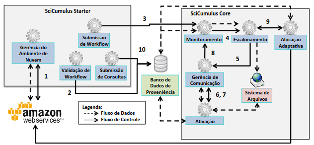

# The Top-15 list of most popular SBBD Demos and Applications on GitHub

While many SBBD applications stand out for their conceptual design, some have also successfully been maintained and expanded over the years, reaching thousands of registered users.

_Without further due, here is the Top-15 list of most popular SBBD Demos and Applications on Github (based on stars and forks)!_

## \# 15 HPSW-Prof - 2016

HPSW-Prof is a profiling framework developed to provide the user with a set of analyses based on provenance information enriched with runtime resource consumption statistics. It consists of R functions for profiling analysis based on the provenance database generated by Swift, a Scientific Workflow Management System. These functions were integrated with the Shiny framework to make it possible to visualize the analyses.
The source code is avaliable [here](https://github.com/mmondelli/swift-prof) and the paper is available [here](https://www.lncc.br/~lgadelha/publications/hpsw-prov-sbbd-demo-2016.pdf).

>  HPSW-Prof aims to provide the user with a set of features for the statistical treatment and manipulation of provenance information obtained from scientific experiments executed with SWfMS Swift. Through the HPSW-Prof, data analysis can become a transparent process since it also offers a visualization layer that supports users for better accessing and manipulating their results.

HPSW-Prof conceptual view

## \# 14 J-EDA - 2019

J-EDA is a practical workbench for the analysis of Content-Based Image Retrieval Parameters ([paper here](https://sbbd.org.br/2019/wp-content/uploads/sites/6/2020/01/Procedings-Companion.pdf)).
It supports the execution of similarity searches with result diversification over multidimensional and image sources.

> Users can inspect a broad set of search parameters as distance functions, query criteria, result diversification, and relevance feedback methods. Data evaluation is carried out through an Experimental interface by incremental batch procedures that generate distinct metrics for supervised and unsupervised datasets. Consolidated metrics, including elapsed time, are reported in a separated interface with easy-to-follow graphics and tables.

A [demonstration video is available on Youtube](https://www.youtube.com/watch?v=K0lDmfTeOZ0), and the system binaries are also available on GitHub.
[Try it](https://github.com/NovaesJVO/J-EDA)!

J-EDA interface.

## \# 13 ParGRES - 2005

ParGRES is a system for the parallel processing of OLAP queries on top of database-center clusters.
It builds on Postgres to provide scalability and fast query processing ([paper here](../ICMC_Lib/2005/ParGRES.pdf)).

> ParGRES is a middleware between the application and the database tiers that provides transparent access from the application to the parallel environment. Query processing in ParGRES combines intra- and inter-query parallelism techniques while using database replication and virtual fragmentation.

The ParGRES source code is available on GitHub.
[Clone it](https://github.com/UFFeScience/C-ParGRES)!

ParGRES architecture

## \# 12 SciCumulus - 2014

SciCumulus is a large-scale data workflow manager that enables running scientific applications in parallel while capturing data provenance at runtime [paper here](https://www.inf.ufpr.br/sbbd-sbsc2014/sbbd/proceedings/artigos/pdfs/SBBD2014-Proceedings.pdf)).

> SciCumulus has a new layer to submit parallel applications, which offer different configuration levels for scientific workflows, including distinct setups for distributed applications and on-the-fly provenance collection and querying.

The demo application video is available [here](https://s3.amazonaws.com/SBBD-Demo/Video-Final.mp4), and the workflow manager source code is available on [GitHub](https://github.com/UFFeScience/SciCumulus).

SciCumulus architecture

## \# 11 OuterTuning - 2018

Outer tuning supports relational database fine-tuning by using domain-oriented ontologies (See [paper here](https://sbbd.org.br/2018/wp-content/uploads/sites/5/2018/08/029-sbbd_2018_comp.pdf)).

OuterTuning architecture

The demo application video is available [here](https://www.inf.puc-rio.br/~postgresql/conteudo/projeto4/video/outertuning.mp4), and the source code is available on [GitHub](https://github.com/BioBD/dbx).

## \# 10 CloudSimDB - 2013

CloudSimDB is a simulator for resource provisioning for database-centric applications. It allows the creation of a virtually unlimited amount of simulation scenarios, enabling the estimation of the cost for cloud services, the expected time for completion of workloads, and the SLA violations for different scenarios.
The source code is available [here](https://github.com/jonaslimads/cloudsimdb) and the paper is available [here](https://sbbd2013.cin.ufpe.br/Proceedings/artigos/pdfs/sbbd_dem_cc.pdf).

CloudSimDB running

## \# 9 FESTIval - 2016

FESTIval (short for Framework to Evaluate SpaTial Indices) is a framework that provides a common environment for defining, executing, and analyzing spatial indices, which is a complex task depending on caching, memory management, and computational architectures.
FESTIval is implemented in C and uses PostGIS, a PostgreSQL extension that handles spatial objects in relational tables ([paper here](https://www.researchgate.net/publication/310295040_Experimental_Evaluation_of_Spatial_Indices_with_FESTIval)).

> FESTIval has been employed in many experimental evaluations (...). In general, FESTIval has been applied to better understand the performance behavior of spatial indices in different storage devices and validate new proposals of spatial indices.

The updated framework's home page is [available here](https://accarniel.github.io/FESTIval/), whereas the source code is [openly available on GitHub](https://github.com/accarniel/FESTIval).
If you are setting up a benchmark for validating spatial indexes, such as R-Tree variations, you should try FESTIval!

FESTIval architecture

## \# 8 Anelim - 2018

Anelim is a data generation tool that aims to enable the automatic creation of very large test datasets.
The source code is available [here](https://github.com/ronaldaraujo/anelim) and the paper is available [here](https://sbbd.org.br/2018/wp-content/uploads/sites/5/2018/08/035-sbbd_2018_comp.pdf).

Anelim logo

## \# 7 PhenoManager - 2019

PhenoManager supports data scientists in structuring, validating, and reproducing phenomena hypotheses by using computational models. It provides API access for querying and exporting metadata through _Research Objects_.
The source code is available [here](https://github.com/UFFeScience/Phenomanager) and the paper is available [here](https://sbbd.org.br/2019/wp-content/uploads/sites/6/2020/01/Procedings-Companion.pdf).

PhenoManager ER diagram

## \# 6 Keras-Prov - 2021

Keras-Prov is a provenance service designed for supporting online hyperparameter analysis in Deep Neural Networks (DNNs). Keras-Prov integrates traditional retrospective provenance data (r-prov) with typical DNN software data, _e.g._, hyperparameters, DNN architecture attributes, etc. using W3C PROV. This solution provides an API that allows users to develop their DNN-based workflows using Keras while being able to analyze online captured provenance data.
The source code is available [here](https://github.com/dbpina/keras-prov) and the paper is available [here](https://sol.sbc.org.br/index.php/sbbd_estendido/issue/view/848).

> Keras-Prov is developed on top of DfAnalyzer provenance services and with modifications to the Keras source code. It uses the columnar DBMS MonetDB to support online provenance data analysis and to generate W3C PROV-compliant documents.

Keras-Prov dataflow exploration interface

<a href="EditorsChoicePart2.md">Click here to continue to the Top-5 Most Popular SBBD Demos and Applications >>.

