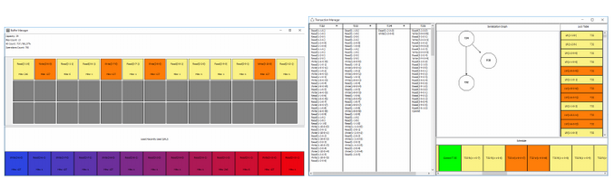

# The Top-15 list of most popular SBBD Demos and Applications on GitHub

While many SBBD applications stand out for their conceptual design, some have also successfully been maintained and expanded over the years, reaching thousands of registered users.

_Without further due, here is the Top-15 list of most popular SBBD Demos and Applications on Github (based on stars and forks)!_

## \# 5 SambA - 2021

SAMbA is an extension to Apache Spark that collects real-time provenance data from RDDs. Give it a try!
The source code is avaliable [here](https://github.com/UFFeScience/SAMbA) and the paper [here](https://sbbd.org.br/2018/wp-content/uploads/sites/5/2018/08/017-sbbd_2018_comp.pdf).

[See also the SambA demonstration video.](https://drive.google.com/file/d/1st1dRJCGyTLNEVjZp5i-nnLjJkVjMNKZ/view)

## \# 4 Data Chain - 2017

Data Chain uses BigchainDB + IPFS to manage digital document exchanges ([paper here](https://www.facom.ufu.br/~humberto/sbbd2017/wp-content/uploads/sites/3/2017/10/proceedings-satellite-events-sbbd-2017.pdf)).

> Motivated by a reality where people easily adulterate, copy, and corrupt digital information, this work presents a proof of concept utilizing blockchain, taking advantage of tamper resistance and property of data characteristics. Focused on digital documents, it opens a variety of use cases and possibilities for those who wish to prove the authenticity and ownership of digital documents or transfer them to someone else.

The system [source code is available on GitHub](https://github.com/gabrielmendanha/datachain).

## \# 3 Seal-DB - 2017

Seal-DB is an open-source prototype of a Database Management System (DBMS) that includes transaction management and caching ([paper here](https://www.facom.ufu.br/~humberto/sbbd2017/wp-content/uploads/sites/3/2017/10/proceedings-satellite-events-sbbd-2017.pdf) and [demonstration video here](https://youtu.be/0_MFatE_j-g)).

> Seal-DB is a relational database management system (DBMS) with a graphical and interactive interface that projects the operation execution of DBMS components. Seal-DB enables students to watch the internals of the DBMS engine. Therefore, this tool facilitates the absorption of concepts and techniques of database systems.

If you are a student, teacher, or professor involved with teaching/learning principles of Database implementation, you [should give Seal-DB a try!](https://github.com/ggustavo/seal-db)

SealDB Buffer and Transaction Manager

## \# 2 Python OAM - 2022

Python-OAM allows you to easily apply Outlier Aspect Mining algorithms and analyze the results in your datasets in an extensible way.
The source code is avaliable [here](https://github.com/rodrigo-fss/python-oam) and the paper is available [here](https://sol.sbc.org.br/index.php/sbbd_estendido/issue/view/988).

> Python OAM is a library that allows the user to apply OAM algorithms and analyze the results.

iPath visualization with Python OAM

## \# 1 brModeloWeb - 2011-2022

With thousands of registered users, brModeloWeb ([paper here](../ICMC_Lib/2011/sbbd_dem_01.pdf) and [here](https://sol.sbc.org.br/index.php/sbbd_estendido/issue/view/988)) is an evolution of brModelo, a free, open-source entity-relationship database modeling tool that uses the Heuser notation for the Entity-Relationship (EER) Model.
The tool gradually evolved its web version in 2015, having started in 2004.
It is updated and maintained by a group of more than eight senior developers on [GitHub](https://github.com/brmodeloweb/brmodelo-app).

> brModeloWeb is a free open-source entity-relationship database modeling tool. We try to make learning database modeling simple and accessible for everyone.

If you are enrolled in a data modeling/introductory database course, you positively should [give it a run!](https://www.brmodeloweb.com/lang/en/index.html)

brModeloWeb interface

## Honorable Mentions ##

We also want to mention this short list of excellent demos with open-source code in the 2004-2022 period:

- [DBEST](https://github.com/pdet/dbest) - A database benchmark framework
- [Weka-GDPM](https://www.inf.ufsc.br/~vania.bogorny/software.html) - A Weka extension to support spatial data
